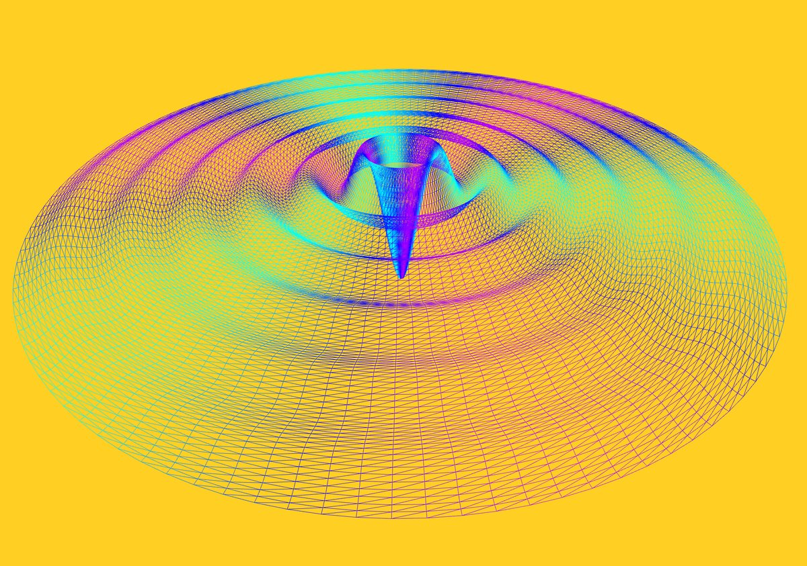
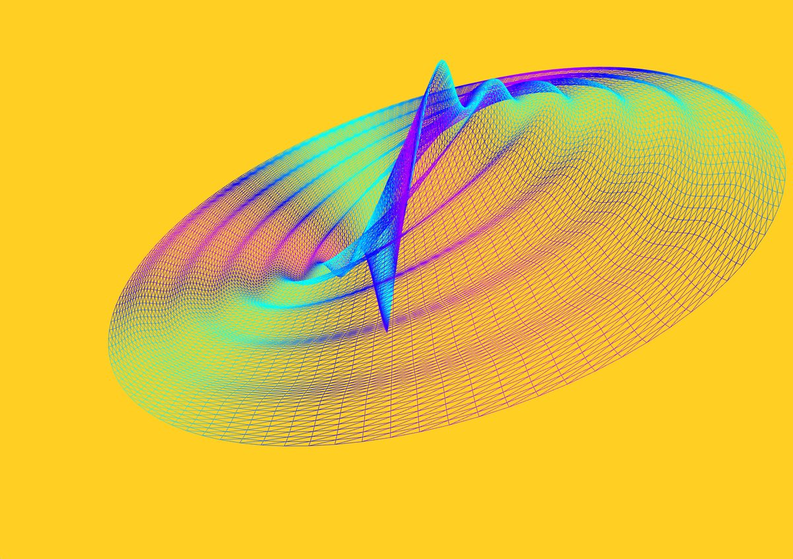
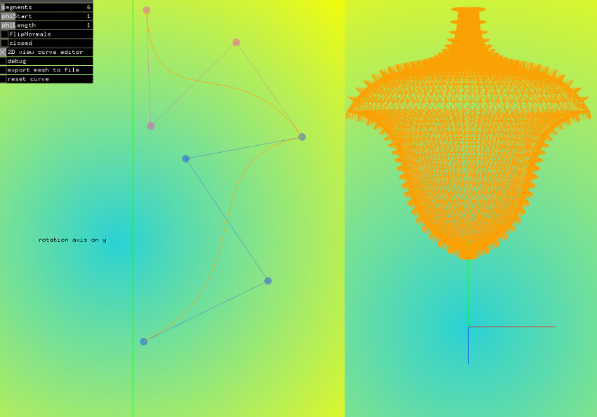
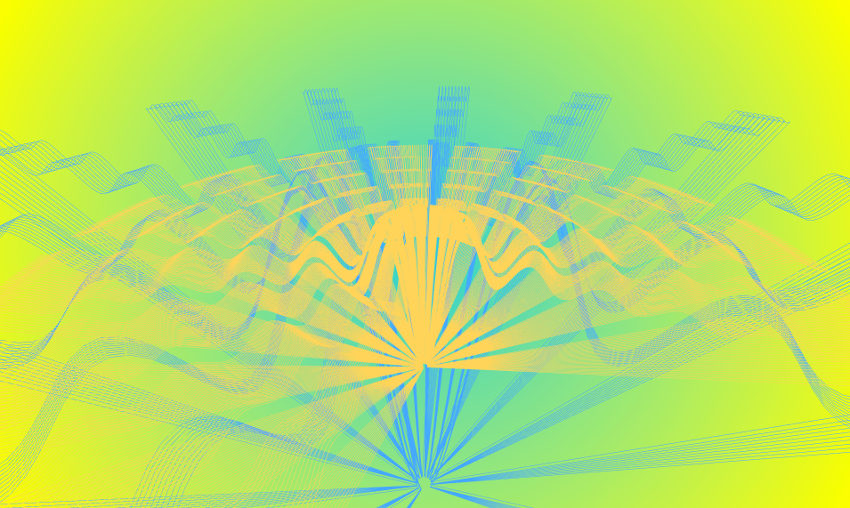
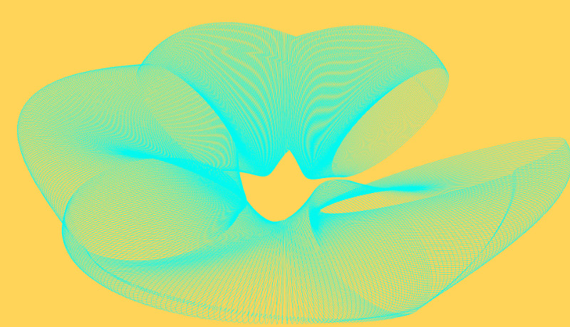

# ofxLathePrimitive

[](https://ci.appveyor.com/project/edap/ofxlatheprimitive)
[](https://travis-ci.org/edap/ofxLathePrimitive)



This addon generates lathe geometries. [Lathe geometries](https://en.wikipedia.org/wiki/Lathe_(graphics)) are geometries produced by rotating some points around a fixed axis, in my addon and in many other similar program, the up axis.

This addon is very close to that one that comes from [THREE.js](https://threejs.org/docs/#api/en/geometries/LatheGeometry), and most of the code comes from there, but it has also some new features, as explained below


## Usage example

A lathe primitive comes with its default, this minimal example is enough to have a lathe geometry in your scene.

```cpp
void ofApp::setup(){
    lathe.build();
}

void ofApp::setup(){
    lathe.draw()
}
```

## API

### Public properties:

The public properties `segments`, `phiStart`, `phiLength` and `points` behave exactly as in this [demo](https://threejs.org/docs/#api/en/geometries/LatheGeometry).

```
ofParameter<int> segments;
```

It defines the number of segments that will compose the rotating geometry.

---
```
ofParameter<float> phiStart;
```

The initial rotation angle.


---
```
ofParameter<float> phiLength;
```

The upper limit of the rotation. A value TWO_PI, for example, means a complete rotation on the y axis


---
```
ofParameter<bool> closed = false;
```

When the first part of the rotating mesh and the last part are close to each other, the mesh will be perfectly closed.


---
```
ofParameter<bool> flipNormals = false;
```

Depending on the order on which the points are inserted, the face of the generated polygon maybe in the inverted direction as expected. This option flip the faces.


---
```
ofParameterGroup parameters;
```

Contains all the parameter listed above.


---
```
vector<glm::vec2> points;
```

The vector containing the point that are going to be rotated around the y axis


### Member methods


```
void setup(const vector<glm::vec2>points, const int segments, const float phiStart, const float phiLength);
```

Setup a new geometry defining points, segments, phiStart and phiLength.


---
```
void build();
```

It builds a `ofMesh`.


---
```
void clear();
```

It clears the mesh.


---
```
void setPoints(vector<glm::vec2> _points);
```

Set the points that are going to be rotated. Example:


```cpp
ofxLathePrimitive lathe;
vector<glm::vec2> points;
for ( int i = 0; i < 12; i ++ ) {
    points.push_back( glm::vec2( sin( i * 0.2 ) * 100 + 5, ( i + 2) * 20 ) );
}
lathe.setPoints(points);
lathe.build();
```


---
```
vector<glm::vec2> getPoints() const;
```

Returns the points that are going to be rotated.


---
```
vector<glm::vec3> getCurrentRotatingPoints() const;
```

Like `getPoints()`, but it returns the points at the last angle rotation. See the example `example-rotating-points`


---
```
std::function<glm::vec3(float, int, int)> addOffset;
```

Lambda function that add an offset to the point position of each rotating point. For example, to add an offset to the y component of point depending on the rotation angle:

```cpp
lathe.addOffset = [](float angle, int segmentIndex, int pointIndex) {
    auto y = sin(angle*3.0) * 9.0;
    return glm::vec3(0,y,0);
};
```


---
```
std::function<glm::vec2(const vector<glm::vec2> points, float, int, int)> editPoint;
```

Lambda function that changes the position of the point while rotating. Example:

```cpp
lathe.editPoint = [offset](const vector<glm::vec2> points, float angle, int segIndex, int pointIndex){
    auto point = points.at(pointIndex);
    glm::vec2 newPoint;

    newPoint.x = point.x * cos(angle*4) * 0.3 + offset.x;
    newPoint.y = point.y * sin(angle*2) * 0.3 + offset.y;

    return newPoint;
};
```

See the example `example-funky-torus`.


---
```
std::function<ofColor(float, int, int)> computeColor;
```

Lambda function that changes the color of the point during the rotation. For example:

```cpp
int totPoints = lathe.points.size();
lathe.computeColor = [totPoints](float angle, int segmentIter, int pointIter) {
    float hue = ofMap(sin(angle*3.), -1, 1, 125, 200);
    return ofColor().fromHsb(hue, 255, 255);
};
```

See the example `example-distorted`.


## Examples

*example-distorted*


*example-editor*


*example-rotating-points*


*example-funky-torus*

